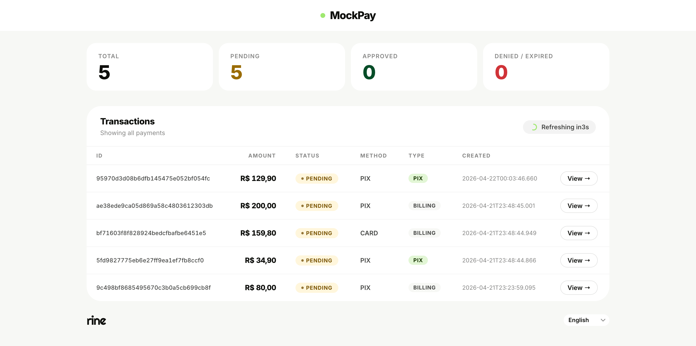
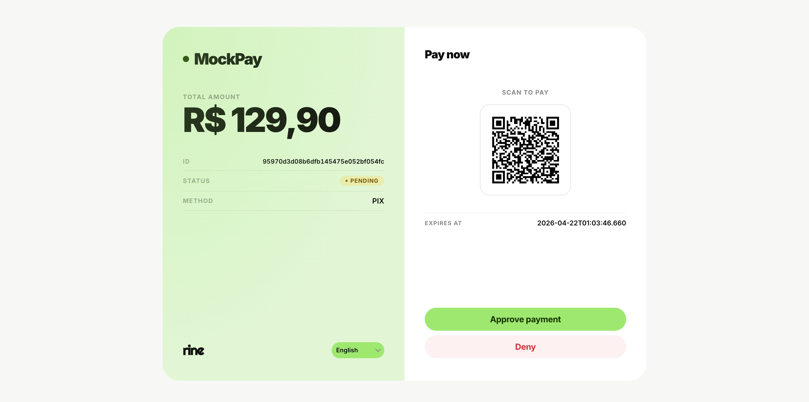
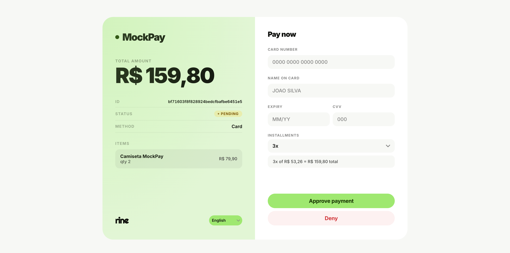
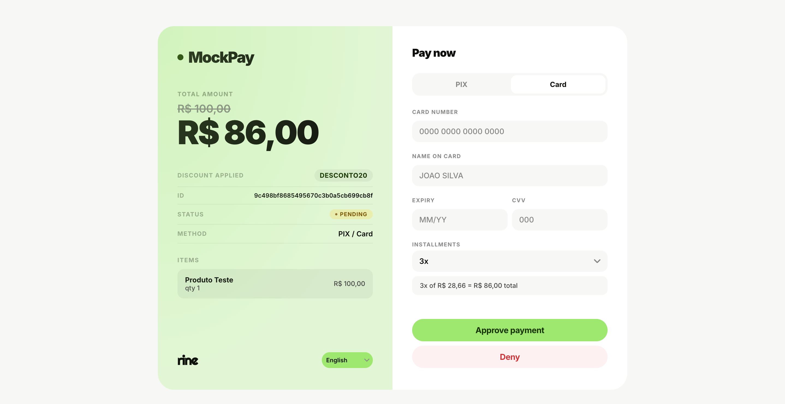

# MockPay

Payment gateway simulator for development and testing. Simulates Brazilian payment flows (PIX, credit card, installments, coupons e etc.) with a visual dashboard and checkout interface.

## Screenshots

| Dashboard | Checkout (PIX) |
|-----------|----------------|
|  |  |

| Checkout (Card) | Checkout (Discount) |
|-----------------|---------------------|
|  |  |

## Quick Start

```bash
git clone git@github.com:WesleiRamos/mockpay.git && cd mockpay
cp .env.example .env
go run main.go
```

Dashboard at `http://localhost:8080/`

## Configuration

| Variable | Default | Description |
|----------|---------|-------------|
| `MOCKPAY_PORT` | `8080` | HTTP listen port |
| `MOCKPAY_API_KEY` | `mock_key` | Bearer token for API authentication |
| `MOCKPAY_BASE_URL` | `http://localhost:<port>` | Base URL for checkout links |
| `MOCKPAY_PUBLIC_URL` | `MOCKPAY_BASE_URL` | URL used in QR codes (set to LAN IP for mobile testing) |
| `MOCKPAY_DB_PATH` | `mockpay.db` | SQLite database file path |
| `MOCKPAY_INTEREST_RATE` | `0` | Default monthly interest rate % for installments |
| `MOCKPAY_WEBHOOK_URL` | *(empty)* | URL to receive webhook events |
| `MOCKPAY_WEBHOOK_SECRET` | *(empty)* | HMAC-SHA256 secret for webhook signatures |

## API Endpoints

| Method | Path | Description |
|--------|------|-------------|
| `POST` | `/v1/billing/create` | Create a billing |
| `GET` | `/v1/billing/get?id=` | Get a billing |
| `GET` | `/v1/billing/list` | List all billings |
| `POST` | `/v1/pix/create` | Create a PIX charge |
| `GET` | `/v1/pix/check?id=` | Check PIX status |
| `POST` | `/v1/customer/create` | Create a customer |
| `GET` | `/v1/customer/list` | List all customers |
| `POST` | `/v1/coupon/create` | Create a coupon |
| `GET` | `/v1/coupon/list` | List all coupons |
| `GET` | `/checkout/:id` | Checkout page |
| `GET` | `/checkout/:id/approve` | Approve payment |
| `GET` | `/checkout/:id/deny` | Deny payment |
| `GET` | `/` | Dashboard |
| `GET` | `/health` | Health check |

Full API documentation: [`docs/en/`](docs/en/) | [`docs/pt-br/`](docs/pt-br/)

## License

MIT
